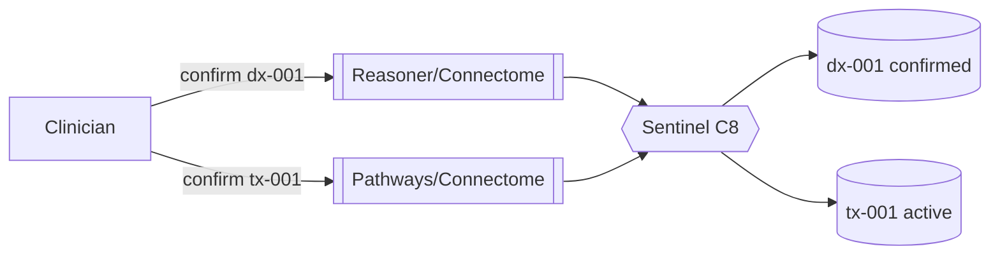

# Worked Example — Console clinician session

> **Illustrative only.** Not real, not runnable. Shows Console's interaction on the running
> case: a clinician asks a plain question about a lesion, Console composes a cross-component
> view with confirmed vs candidate clearly marked, the clinician **confirms** the candidate
> diagnosis and plan, and the promotions route back. Data:
> [`clinician-session-example.json`](clinician-session-example.json).
> Ties to [`../connectome/patient-example.md`](../connectome/patient-example.md)
> (`pat-001`, `les-001`, `find-*-001`, `dx-001`, `tx-001`, `prog-001`, `prog-002`),
> [`../reasoner/diagnosis-example.md`](../reasoner/diagnosis-example.md) (candidate `dx-001`)
> and [`../pathways/treatment-and-monitoring-example.md`](../pathways/treatment-and-monitoring-example.md)
> (`tx-001`, `prog-001`, `prog-002`).

## The question (exploratory profile)

A clinician opens a session on `pat-001` and asks:

> *"What's going on with pat-001's left frontal lesion?"*

Trust profile: **exploratory** (so candidates and discoveries are included, flagged).

## L2 — parse intent, gather

- **Intent (LLM):** `explain` / `navigate`, subject resolved to lesion `les-001`.
- **Connectome navigation:** cross-modal findings (journey A) + history (B) + dx→plan (C) +
  timeline (D).
- **Reasoner:** the differential — top candidate `dx-001` (high-grade glioma, conf 0.62) +
  look-alikes; recommended next test = **biopsy**.
- **Pathways:** `tx-001` (resection → chemoradiation → adjuvant) + the `prog-001`→`prog-002`
  timeline.
- **Recall (exploratory):** similar prior case `pat-417`.

## L4 — compose the lesion dashboard

| Panel | Contents | Trust |
|---|---|---|
| Cross-modal findings | `find-mri-001`, `find-ct-001`, `find-us-001`, `find-histo-001` (all manifest `les-001`) | ✔ confirmed |
| History | `hist-001` — 3-wk headaches + right-arm weakness | ✔ confirmed |
| Differential | **`dx-001` high-grade glioma (0.62)** + demyelination + abscess | ⧗ candidate |
| Next test | biopsy / histology | recommendation |
| Plan | `tx-001` — resection → chemoradiation → adjuvant | ⧗ candidate (pre-confirm) |
| Progression | `prog-001` stable → `prog-002` progression (73 d) | ⧗ candidate assessments |
| Discovery | similar case `pat-417` (sim 0.92) | ◇ discovered |

## L5 — mark + explain

Confirmed manifestations render solid; the candidate `dx-001`, plan, assessments and the
discovered case render with their distinct badges (`08`). The grounded explanation:

> *"Leading **candidate**: high-grade glioma — ring enhancement with rim restriction
> (`find-mri-001`) and mass effect (`find-ct-001`), concordant with precedent `pat-417`;
> WHO-CNS5 grade indeterminate pending tissue → **biopsy** recommended."*

Every clause cites graph evidence; nothing is asserted beyond the bundle.

## The clinician confirms (after histology)

Histology `find-histo-001` returns grade 4. The clinician reviews the evidence and acts:

1. **Confirm `dx-001`** → `confirmCandidate(dx-001, confirm)` routes the promotion to
   **Reasoner / Connectome**; Sentinel-governed → `dx-001` becomes **confirmed**;
   `find-histo-001 ─confirmed_by→ dx-001`.
2. **Confirm `tx-001`** → `confirmCandidate(tx-001, confirm)` routes to
   **Pathways / Connectome** → `tx-001` becomes **active**.

Console **relayed** the human decisions; it wrote nothing itself.

## draftReport

The clinician asks for a case report. Console drafts the **lesion case report** template
(`08`): header (`pat-001`/`les-001`), history (`hist-001`), imaging (`find-mri/ct/us-001`),
pathology (`find-histo-001`), diagnosis (now **confirmed** `dx-001`), plan (now **active**
`tx-001`), progression (`prog-001`→`prog-002`), provenance footer. `status: draft` — the
clinician edits and signs.

## What Console did vs. didn't

| Console did | Console did **not** |
|---|---|
| parse the NL question, gather across 4 components | diagnose (Reasoner) or plan/monitor (Pathways) |
| compose one lesion dashboard, lesion-centric | persist anything (Connectome writes) |
| mark confirmed vs candidate, apply the profile | auto-confirm — the clinician decided |
| relay the confirm → route promotion back | promote it itself (the owner did, Sentinel-governed) |
| draft a grounded report | author/sign the medical record |
