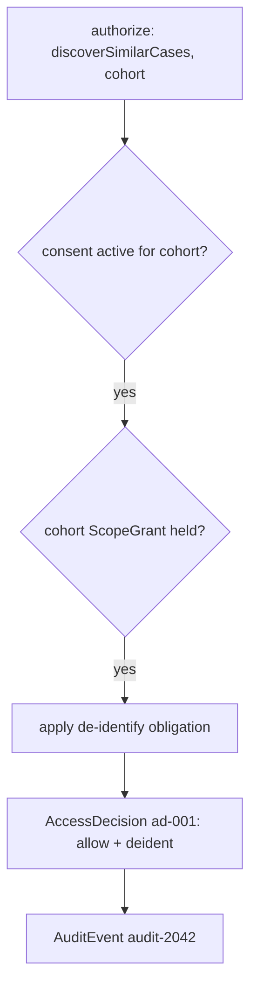
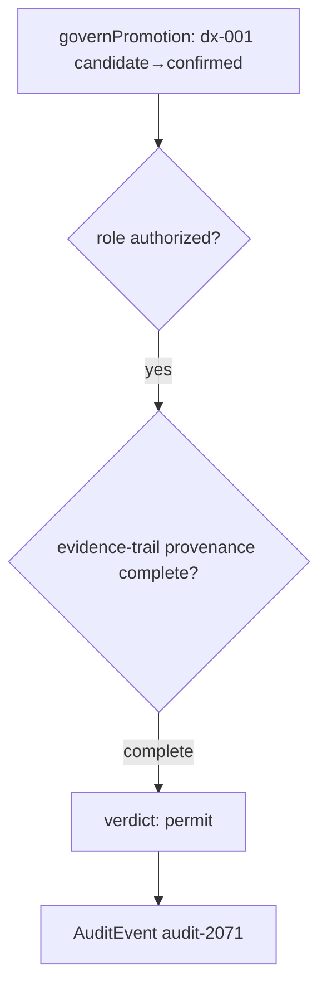

# Worked Example — Sentinel governing two moments in the case

> **Illustrative only.** Not real, not runnable. Shows Sentinel (C8) governing **two**
> moments in the running case: (1) authorizing + auditing a **cohort discovery**
> (`discoverSimilarCases(pat-001)` reaching `pat-417`) with a consent/scope check and
> de-identification, and (2) governing the **candidate→confirmed promotion** of `dx-001`
> with a role + provenance-complete check. Sentinel **authorizes, gates, validates and
> records** — it produces no clinical content. Data:
> [`governance-example.json`](governance-example.json). Ties to
> [`../recall/discovery-example.md`](../recall/discovery-example.md),
> [`../reasoner/diagnosis-example.md`](../reasoner/diagnosis-example.md) and
> [`../connectome/patient-example.md`](../connectome/patient-example.md).

## Moment 1 — authorizing a cohort discovery (Jun 29)

Recall is about to serve `discoverSimilarCases(pat-001)` on **cohort** scope (the query that
reaches `pat-417`, `samples/recall/discovery-example.json` → `queryG_similarCases`). Before
serving, Recall calls Sentinel.

### The request

```
Recall ──▶ Sentinel.authorize(action=discoverSimilarCases, scope=cohort)
        ──▶ Sentinel.checkConsent(pat-001, discoverSimilarCases, cohort)
```

### What Sentinel assembles (L4) and decides (L5)

| Part | Value |
|---|---|
| **Principal** | `user-clin-22` (clinician, MDT member, org neuro-onc) |
| **ConsentRecord** | `consent-pat-001-cohort` — `active`, purpose cohort-discovery-for-care, restriction `de-identified-only` |
| **ScopeGrant** | `grant-clin-22-cohort` — `cohort` scope on partition `cohort-deident-neuro-onc`, obligation `deident` |
| **Decision** | `ad-001` → **allow + de-identify** |



### Outcome

Sentinel returns **allow with a de-identify obligation**. Recall serves the cohort match
(`case-pat-417`) **de-identified** — no direct identifiers — exactly the scoping described in
`docs/components/recall/08-granularity-and-spaces.md`. The decision is recorded as an
immutable `AuditEvent` (`audit-2042`, hash-chained).

## Moment 2 — governing the promotion of dx-001 (Jan 12)

The biopsy is back: histology `find-histo-001` (grade 4) is in Connectome and Reasoner's
WHO CNS criteria now read **met** (`samples/reasoner/diagnosis-example.json` →
`updateAfterHistology`). A clinician confirms candidate `dx-001` via **Console**, which calls
Sentinel to govern the promotion.

### The request

```
Console ──▶ Sentinel.governPromotion(dx-001: candidate→confirmed)
```

### What Sentinel checks (L5)

| Check | Result |
|---|---|
| **Role authority** — promotion requires `attending` / `mdt-member` | `user-clin-22` holds both → **authorized** |
| **Provenance completeness** — every assertion in the evidence trail carries a complete `ProvenanceRecord` | `find-mri-001`, `find-ct-001`, `find-histo-001`, `dx-001` all **complete** → **complete** |



### The evidence trail it validated

| Assertion | asserted_by | method | confidence | completeness |
|---|---|---|---|---|
| `find-mri-001` | algorithm | seg-v2 | 0.91 | complete |
| `find-ct-001` | algorithm | seg-v2 | 0.88 | complete |
| `find-histo-001` | human | manual read | 0.98 | complete |
| `dx-001` | algorithm | hybrid: rules+llm | 0.62 | complete |

### Outcome

Sentinel returns **`permit`** (`ad-002`) and records `audit-2071`. Console then confirms
`dx-001` → `status: confirmed` in Connectome. **Sentinel recorded who confirmed and that the
trail was complete; it did not confirm the diagnosis itself** — the human did. An incomplete
trail (a finding missing `asserted_by`/`confidence`) would have **blocked** the promotion.

## What Sentinel did vs. didn't

| Sentinel did | Sentinel did **not** |
|---|---|
| authorize cohort discovery + apply de-identification | run the discovery (Recall did) |
| check consent + scope grant | store consent (the registry does) |
| gate the promotion (role + provenance-complete) | confirm the diagnosis (the clinician did, via Console) |
| validate the evidence-trail provenance | assert any finding (Perception/Reasoner did) |
| record immutable, hash-chained `AuditEvent`s | write or edit the clinical graph |

> Provenance is the through-line: every assertion carries it
> (`docs/components/connectome/04-domain-model.md`), Sentinel validates it on the way in and
> re-checks it decisively at promotion, and audits the decision either way.
